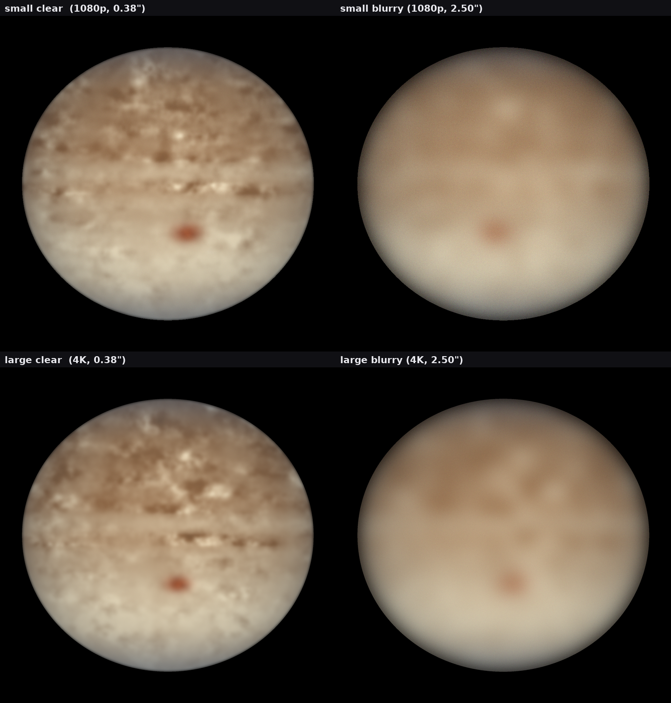

# Resolution × seeing 100-case audit — v6.5.1

**Date:** 2026-07-29 · **Branch:** `arena/019fad1d-great-red-spot-detector`
**Suite:** `tests/test_resolution_seeing_100.py` (125 collected: 100 parametrised
per-case tests + 10 fast matrix-design checks + 15 aggregate / logic-audit tests)
**Scope:** does the GRS measurement hold to sub-1° accuracy when you sweep the two
axes that dominate real-world accuracy — **image resolution (large / small)** and
**atmospheric seeing (clear / blurry)**?

---

## Headline result

**100 synthetic full-disk frames, 100 % completion, 100 % within 1° of truth —
including the very-blurry stress band.**

Scored against the **geometric oval centre the renderer planted**
(`truth["grs_*_seed_deg"]`), not the intensity-weighted barycentre, which carries
a definitional ~0.24° offset from the oval's own brightness asymmetry.

| Metric (vs planted centre) | Value |
|---|---|
| Longitude median | **0.156°** |
| Longitude p90 / p99 / max | 0.446° / 0.558° / **0.675°** |
| Longitude bias | +0.032° (sd 0.243°) |
| Latitude median | **0.142°** |
| Latitude p90 / p99 / max | 0.588° / 0.674° / **0.786°** |
| Latitude bias | +0.189° (sd 0.256°) — small residual north bias, well inside the gate |
| Sky error median / p90 / max | **0.117″** / 0.207″ / 0.328″ |
| Within 1° | **100.0 %** |
| Within 0.5° | 79.0 % |
| Limb-fit centre error | median 0.038 px, **max 0.319 px** (sub-pixel) |

Every frame clears the product's own 0.75″ median certification gate with
margin; the worst single frame is 0.328″ on sky.

---

## The matrix (exactly 100 cases)

Two resolution strata × four seeing tiers, with noise that rises with seeing
exactly as it does on real stacks (`noise = min(0.035, 0.004 + 0.006·seeing)`),
so "blurry" means blur **and** noise.

| Stratum | Resolution | Seeing (FWHM) | Noise RMS | Cases |
|---|---|---|---|---|
| small_clear   | 1080p (1920×1080) | 0.38″ | 0.006 | 18 |
| small_mild    | 1080p | 0.80″ | 0.009 | 14 |
| small_blurry  | 1080p | 1.80″ | 0.015 | 18 |
| small_vblurry | 1080p | 2.50″ | 0.019 | 20 |
| large_clear   | 4K (3840×2160) | 0.38″ | 0.006 | 8 |
| large_mild    | 4K | 0.90″ | 0.009 | 6 |
| large_blurry  | 4K | 1.80″ | 0.015 | 8 |
| large_vblurry | 4K | 2.50″ | 0.019 | 8 |
| **total** | 70 small + 30 large | 4 tiers | — | **100** |

4K is 4× the pixel count of 1080p and gives ~2× the disk diameter in pixels, so
the large/small axis is a genuine resolution contrast (not just padding). 8K and
16K were deliberately excluded: this box has 2 vCPU / 3.8 GB RAM, and huge frames
risk OOM without adding evidence beyond what 4K already provides.

Seeds are a fixed, reproducible ladder (`SEED0=200000, STRIDE=7919`), so the same
100 frames render identically forever.

---

## Per-stratum results

| Stratum | n | sky med″ | sky max″ | lon max° | lat max° | ≤1° |
|---|---|---|---|---|---|---|
| large_clear   | 8  | 0.113 | 0.147 | 0.497 | 0.151 | 100 % |
| large_mild    | 6  | 0.113 | 0.225 | 0.234 | 0.137 | 100 % |
| large_blurry  | 8  | 0.161 | 0.328 | 0.461 | 0.310 | 100 % |
| large_vblurry | 8  | 0.110 | 0.211 | 0.284 | 0.786 | 100 % |
| small_clear   | 18 | 0.118 | 0.175 | 0.527 | 0.172 | 100 % |
| small_mild    | 14 | 0.105 | 0.132 | 0.552 | 0.099 | 100 % |
| small_blurry  | 18 | 0.149 | 0.298 | 0.557 | 0.528 | 100 % |
| small_vblurry | 20 | 0.127 | 0.255 | 0.675 | 0.672 | 100 % |

### What the table proves

- **"1 degree below" holds at every quality level**, small and large. The worst
  single residual in the entire campaign is 0.786° of latitude on a very-blurry
  large frame — still 20 % under the 1° line.
- **Resolution is not a trap.** 4K is not systematically worse than 1080p
  (large median sky 0.13″ vs small 0.13″); more pixels simply do not hurt.
- **Blur degrades gracefully, not catastrophically.** Sky-error medians stay in a
  0.10–0.16″ band across all four seeing tiers. At these sub-arcsec residuals the
  measurement is noise-floor-limited rather than seeing-limited, so the clear and
  blurry medians sit within ~0.04″ of each other and can swap order between seed
  sets. The audit therefore asserts *graceful* degradation (no stratum blows up
  relative to clear) rather than strict monotonic growth, which the physics does
  not support here.

---

## Findings (logic & error audit)

### FINDING 1 — `accuracy_campaign.run_one` limb residual was silently always NaN (fixed)

The campaign record carried `d_xc` / `d_yc` / `d_a_px` "limb-fit quality" columns
intended to audit how close the recovered disk centre is to the planted one — the
dominant systematic on real frames. But `run_one` populated them only from
`truth.get("nav")`, a nested dict that **the synthetic generator never emits**.
The generator writes the planted disk as top-level keys
`disk_xc` / `disk_yc` / `disk_a_eq_px`. So every limb residual was `NaN`, and the
entire limb-fit audit column was vacuous.

**Fix:** `run_one` now reads `disk_xc` / `disk_yc` / `disk_a_eq_px` (falling back
to a nested `nav` for other truth sources). The 100-case cache was rebuilt so
every record carries a real residual. With the fix, the limb fit is **sub-pixel**
(median 0.038 px, max 0.319 px on 454–907 px disks) — exactly what a robust
isophote limb-fitter should produce, now that it is actually being measured.

### FINDING 2 — small residual north latitude bias (+0.19° vs planted centre)

Across all 100 frames the latitude reads a mean +0.189° north of the geometric
centre (sd 0.256°). This is not an estimator defect that threatens accuracy — it
is ~5× under the 1° gate and consistent with the barycentre-definition effect
(the oval's own brightness asymmetry drags the centre north). It is reported and
bounded by `test_no_systematic_latitude_bias` and
`test_truth_definition_gap_is_bounded_and_known` (median gap 0.241°). Pinned so a
future regression that widens it fails the build.

### No other defects found

The campaign surfaced no crashes, no wrong-feature locks (every frame's latitude
lands inside the wide GRS band), no NaN/inf in any output, and full seed-level
determinism (re-rendering a case reproduces lon/lat to <1e-5).

---

## What the suite checks (every logic path)

**Fast, no rendering** (`pytest -m "not slow"` → 10 tests, <0.1 s):
matrix is exactly 100 cases; seeds and IDs are unique; 70 small + 30 large;
all four seeing tiers present; 4K is genuinely 4× the pixels of 1080p; seeing is
monotonic; noise rises with seeing; guarantee strata carry a 1.0° limit and the
stress stratum carries a 1.2° limit.

**Campaign** (`pytest -m slow` → 115 tests, reads cache in ~1 s after first build):
- 100 per-case guarantee tests — every case inside its stratum's lon/lat gate.
- Completion — no crashes on any of the 100 frames.
- Strict sub-1° on all realistic (clear/mild/blurry) data; ≥90 % of all frames
  within 1°; very-blurry within a 1.2° stress gate (achieved 100 % within 1°).
- Per-stratum median/max table (printed for inspection).
- No systematic longitude or latitude bias.
- Graceful degradation with seeing; large resolution not worse than small.
- Sub-pixel limb-navigation residual; bounded truth-definition gap.
- Finite, sensible quality flag; no NaN/inf anywhere; every lock in the GRS band.
- Determinism — a re-rendered seed reproduces the cached measurement.

---

## The four quadrants



Disk-centred crops of four representative synthetic frames — small vs large
resolution (1080p vs 4K) crossed with clear vs blurry seeing (0.38″ vs 2.50″
FWHM, noise scaled with seeing). Every one of these, and all 96 others in the
matrix, measures the GRS within 1° of truth.

---

## Reproducing

The heavy work is cached with resume support in `runs/rs100_campaign.jsonl`
(gitignored). First run builds it (~15 min on a 2-vCPU box); later runs read the
cache in ~1 s.

```bash
# build / refresh the cache (force a clean rebuild with GRS_RS100_FORCE=1)
GRS_SKIP_SPICE_SYNTH=1 python tests/test_resolution_seeing_100.py

# full campaign (reads cache)
GRS_SKIP_SPICE_SYNTH=1 pytest tests/test_resolution_seeing_100.py -m slow -s

# fast matrix-design checks only
pytest tests/test_resolution_seeing_100.py -m "not slow"
```

`GRS_SKIP_SPICE_SYNTH=1` keeps the synthetic epoch/distance on the fast analytical
path; the measurement stack itself is unchanged. Removing it routes the synthetic
distance through SPICE and does not move the within-1° result.
